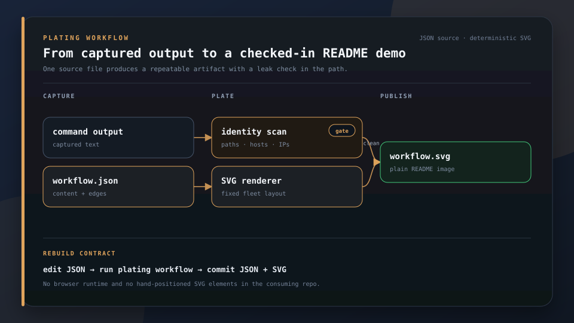

<p align="center">
  
</p>

<h1 align="center">plating</h1>

<p align="center">
  
</p>

<p align="center">
  <strong>Reproducible terminal demos and workflow diagrams for READMEs.</strong>
</p>

<p align="center">
  Build animated terminal demos from captured output or static workflow diagrams from JSON. Generated SVGs embed directly in GitHub with no browser runtime.
</p>

<p align="center">
  <a href="#install">Install</a> &middot; <a href="#use-it">Use it</a> &middot; <a href="https://github.com/escoffier-labs/brigade">Used by Brigade</a>
</p>

<p align="center">
  
  
  
</p>

## Install

```bash
pipx install plating-cli
npm install -g svg-term-cli   # SVG renderer plating shells out to
plating render examples/plating-demo.json
```

## What it does

| | Job | What you get |
|---|---|---|
| **Spec** | JSON steps + outputs | Commands stay honest; animation is synthesized |
| **Scan** | Refuse identity leaks | Home paths, username, hostname, private IPs |
| **Render** | Animated SVG embed | GitHub README and sites as a plain img |
| **Diagram** | Lay out a workflow from JSON | Matching static SVGs across repositories |
| **Verify** | Drift detection | Re-run specs when CLI output changes |

<p align="center">
  
</p>

<p align="center"><em>That recording was made by plating itself.</em></p>


## Use it

Write a spec, `quickstart.json`:

```json
{
  "title": "quickstart",
  "width": 84,
  "steps": [
    { "command": "mytool --version", "output": "mytool 1.2.3\n" },
    { "command": "mytool build", "output_file": "build-output.txt" }
  ]
}
```

Render it:

```bash
plating render quickstart.json
# wrote quickstart.svg   (and quickstart.cast, the reproducible source)
```

Then embed `quickstart.svg` in your README or drop it into a site.

## Workflow diagrams

`plating workflow` renders a constrained JSON document into the shared Escoffier Labs workflow style. Authors name columns, nodes, and connections; connections are forward-only, running from an earlier column to a later column. Plating owns the canvas, spacing, typography, colors, arrows, and accessible SVG metadata.

```json
{
  "title": "Source to release",
  "eyebrow": "BUILD WORKFLOW",
  "description": "Tracked source passes through verification before release.",
  "columns": [
    {"title": "INPUT", "nodes": [{"id": "source", "label": "source"}]},
    {"title": "CHECK", "nodes": [{"id": "test", "label": "tests", "kind": "focus"}]},
    {"title": "OUTPUT", "nodes": [{"id": "release", "label": "release", "kind": "success"}]}
  ],
  "edges": [
    {"from": "source", "to": "test"},
    {"from": "test", "to": "release", "label": "pass"}
  ]
}
```

```bash
plating workflow examples/workflow.json
# plating: wrote examples/workflow.svg
```

Commit the JSON source and generated SVG together. Re-running the command with the same source produces the same bytes.

<p align="center">
  
</p>

## Where each step's output comes from

In priority order:

| In the step | Output is |
|---|---|
| `"output": "..."` | the literal string |
| `"output_file": "path"` | a captured-output file (relative to the spec) |
| `"run": true` (or `plating render --run`) | the live result of running `command` |

Live capture (`--run`) is convenient; committing captured output is what makes it reproducible in CI. Use `normalize` to rewrite a throwaway path into something clean:

```json
{ "normalize": [["/tmp/tmp.AbC123/demo", "~/my-repo"]] }
```

## Sanitization

Before rendering, plating scans the recording for `/home/...` and `/Users/...` paths, the machine's current username and hostname, and private IPs. If it finds one it refuses to render and tells you how to fix it with a `normalize` rule or an explicit `--allow-leaks` override.

```bash
plating scan some-recording.cast
```

## Options

**Spec keys:** `title`, `width`, `height`, `padding`, `window` (macOS chrome, on by default), `prompt`, `prompt_color`, the timing knobs (`type_speed`, `line_delay`, `command_pause`, ... see `src/plating/cast.py`), `normalize`, `scan_patterns`, `scan_policy`, `cwd`.

**CLI:**

```
plating render <spec> [--run] [--cwd DIR] [--out-dir DIR] [--png MS] [--allow-leaks]
plating scan <file>
plating workflow <spec> [--out FILE]
```

`--png MS` writes a static PNG of the frame at MS milliseconds (via headless Chrome), handy for a quick eyeball before you commit the SVG.

## A real example

`examples/brigade-quickstart.json` rebuilds the quickstart recording used in the [Brigade](https://github.com/escoffier-labs/brigade) README from its real, captured output:

```bash
plating render examples/brigade-quickstart.json
```

## License

MIT. See [LICENSE](LICENSE).
